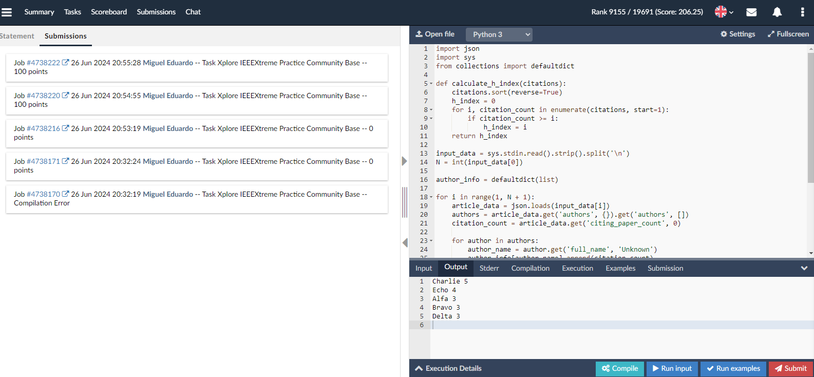
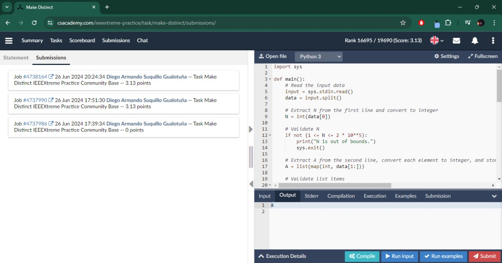
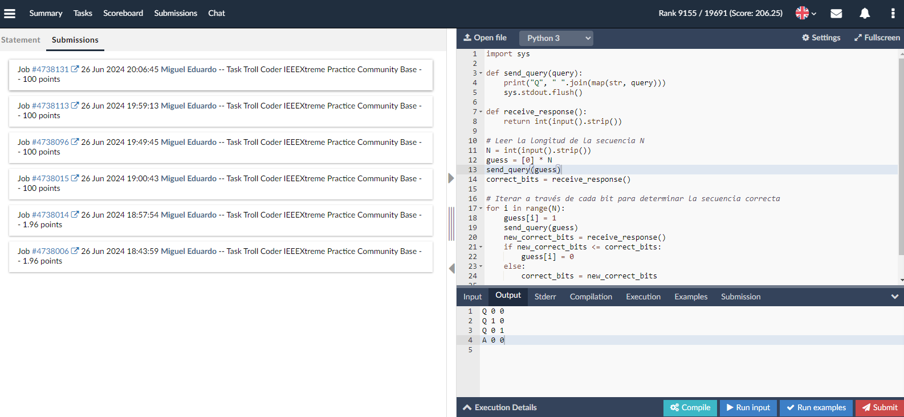

# 🖥️ [Taller 01] Programación

### Integrantes ✒️

_Todos los colaboradores del proyecto desde sus inicios son:_

- Miguel Muzo
- Diego Suquillo
---
## 📋 Problemas a Resolver

1. [🧭 Xplore](https://csacademy.com/ieeextreme-practice/task/xplore/)
2. [🗃️ Make Distinct](https://csacademy.com/ieeextreme-practice/task/make-distinct/)
3. [🧩 Troll Coder](https://csacademy.com/ieeextreme-practice/task/troll-coder/)

## 📄 Informe de Problemas Resueltos

### 🧭 Xplore

- **Descripción**: Calcular el índice h de los autores a partir de datos en formato JSON.
- **Método de Resolución**: Análisis de artículos y citas para cada autor.

#### Captura de Pantalla - Xplore

### 🗃️ Make Distinct

- **Descripción**: Modificar un arreglo para que todos sus elementos sean distintos con la mínima cantidad de operaciones.
- **Método de Resolución**: Uso de estructuras de datos para mantener elementos únicos.

#### Captura de Pantalla - Make Distinct

### 🧩 Troll Coder

- **Descripción**: Adivinar una secuencia de bits interactuando con un troll que da pistas sobre la cantidad correcta de bits.
- **Método de Resolución**: Estrategia de consulta iterativa para encontrar la secuencia correcta.

#### Captura de Pantalla - Troll Coder

